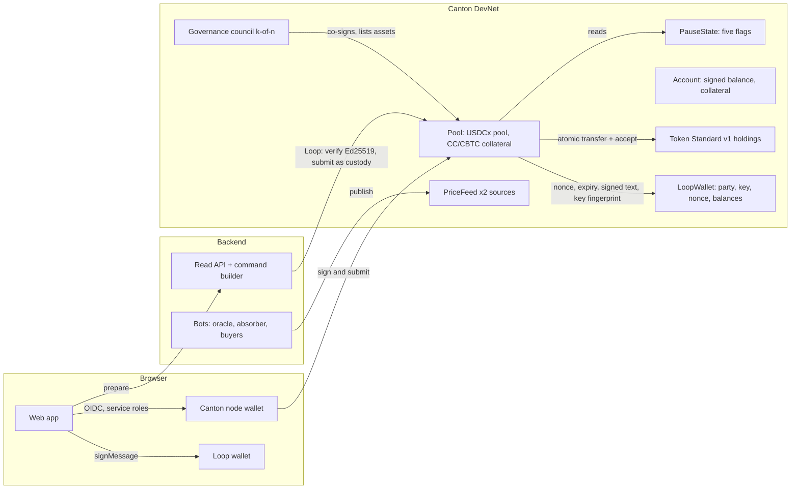

# Canton Lending Protocol

Pooled lending on Canton Network, Compound V3-style. Suppliers deposit USDCx and earn yield; borrowers post CC or CBTC as collateral and borrow USDCx. Each account has one USDCx balance (positive: a deposit, negative: a debt) backed by all of its collateral. An undercollateralized account is absorbed by the protocol, which then sells the collateral at a discount. Every money check (borrow capacity, liquidation point, caps, price validity) is enforced by Daml contracts; off-chain services prepare and initiate operations. One exception, stated plainly: Loop wallets are custodial (see "Loop only for users" below). Their Ed25519 signature is verified by the backend, which then submits as the custody party; the contract binds the operation to the signed text, nonce and expiry but cannot check the signature itself.

Built for HackCanton S3, Financial Applications track. Live on Canton DevNet: https://lending.canborsa.com

All code in this repository was written during the hackathon, from the first commit on 29.09.2026.
The team built it with AI coding agents (Claude Code, OpenAI Codex): they wrote most of the code,
tests and docs to the team's specs, and the team reviewed the changes and ran the checks below.

## Layout

| Path                         | What                                                                                  |
| ---------------------------- | ------------------------------------------------------------------------------------- |
| `daml/lending-core-v2`       | Protocol contracts: pool, accounts, prices, absorb and sale, pauses, Loop accounts    |
| `daml/lending-governance-v2` | k-of-n council: parameters, roles, asset listing, reserves                            |
| `daml/lending-decman`        | Council run by a BitSafe Decentralized Party (Decentralization Manager actions)       |
| `daml/lending-mocks`         | Test Featured App right for sandbox and DevNet; no daml-script, so it can be uploaded |
| `daml/lending-deploy`        | Deploy script for real assets (TestNet, MainNet); run by dpm script, never uploaded   |
| `daml/lending-tests`         | Daml Script tests and the DevNet deploy script (never uploaded)                       |
| `backend`                    | Fastify + TypeScript: read API, command builder, oracle, absorb and buyer bots        |
| `frontend`                   | Vite + React + Tailwind + shadcn/ui; Loop wallet, Canton node login for service roles |
| `packages/shared`            | Types and the Loop signing message shared by backend and frontend                     |
| `scripts`                    | Toolchain, DevNet deploy and login                                                    |

## Architecture



- **Loop only for users: a custodial model.** Loop does not run third-party DARs, so a Loop user
  gets a sub-account of the protocol's custody party, and the custody party holds the tokens. Every
  operation is a Loop `signMessage` text. The backend verifies the Ed25519 signature (Daml has no
  Ed25519 check) and submits as custody; the contract checks the nonce, the expiry, that the text
  matches the operation and that the key is the party's namespace key. So for Loop accounts the
  custody operator is trusted not to submit operations the user did not sign; the frontend
  protects against a tampered response by signing only text that matches the user's input. Service roles (guardian, treasury,
  council) sign in with their Canton node account on `/operator`. The trust model is in the
  team's ADR-006 (Loop wallet), kept outside this repository.
- The operator party holds pooled tokens. Each user action is one choice on `Pool`; the choice
  body carries the user's (or custody's) and the operator's authority, so a Token Standard
  transfer and its acceptance settle in the same transaction as the accounting update.
- For Canton-party wallets (node accounts) the backend authorizes nothing: it returns the command
  and the disclosed contracts, the user's wallet signs and submits, and the contract decides. For
  Loop accounts it returns the exact text to sign, the frontend signs only if it matches what the
  user entered, and the backend's signature check is the custodial step above.
- New collateral markets are listed by the council (`MarketListing_Execute`, threshold plus
  operator). The config and the pool get the market in one transaction. The council removes a
  market the same way (`Delisting_Execute`) once users have withdrawn all its collateral
  (`Pool_RemoveMarket` checks `totalCollateral = 0`). A delisting writes nothing off, the council
  never sees accounts or wallets, and the instrument keeps its transfer factory.
- **BitSafe Decentralization Manager.** The council can have one member: a BitSafe Decentralized
  Party hosted on the nodes of independent organizations. Its `GovernanceRules`
  (`governance-core-v1`) collect the k-of-n confirmations and execute the `lending-decman` actions
  (`GovernableAction`): parameters, roles, factories, market listing, protocol income, council
  rotation. A change that needs the operator is only proposed by the vote; the operator executes it,
  as with the regular council. The party sees the config and the proposals, not accounts or the pool.
- Prices: the oracle takes CoinGecko, KuCoin and Binance, publishes the median of agreeing
  sources and holds large jumps until they are confirmed.

### What differs from Compound V3

| Difference            | Compound V3                                      | Here                                                                                                            | Why                                                          |
| --------------------- | ------------------------------------------------ | --------------------------------------------------------------------------------------------------------------- | ------------------------------------------------------------ |
| Who absorbs           | Anyone                                           | The operator                                                                                                    | Positions on Canton are private: only the operator sees them |
| Who buys collateral   | Anyone                                           | Approved buyers (liquidators, backstop)                                                                         | The buyer never learns whose position it was                 |
| Withdraw and borrow   | One action: withdrawing past the deposit borrows | Two different signed texts: Withdraw and Borrow                                                                 | A Loop user signs text and must see they take a debt         |
| Pauses                | Five flags; a supply pause also blocks repayment | Five flags in their own contract; supply and repayment never pause                                              | Spec §11                                                     |
| Minimum collateral    | None                                             | A collateral deposit or partial withdrawal moves at least `minCollateralAmount`; withdraw-all is always allowed | Tiny operations contend for the one pool contract            |
| Prices                | One feed per asset                               | Two sources, deviation and freshness checks                                                                     | Stricter than Compound                                       |
| Launch limits         | None                                             | Total borrow cap, per-user cap, 80% utilization ceiling                                                         | Careful launch; lifted by a parameter                        |
| Negative reserves     | The protocol carries on                          | New loans and deposit withdrawals wait for recapitalization                                                     | Losses are not spread onto suppliers automatically           |
| CBTC proof of reserve | None                                             | Without a fresh attestation CBTC adds no borrow capacity                                                        | Spec §6                                                      |
| Governance delay      | A 2-day timelock on every change                 | 2 days only for a lower liquidation factor; the rest applies at once                                            | Absorb takes all collateral: borrowers get time to react     |
| Service features      | COMP rewards, transfers, managers, bulk actions  | None                                                                                                            | Not needed for launch; every Loop operation is signed alone  |

### Design records

Code comments cite the team's architecture decision records (ADR-001…009) and `docs/`. These are
internal working notes in Russian and are not published; the decisions they cite are:

| Record  | Decision                                                                                            |
| ------- | --------------------------------------------------------------------------------------------------- |
| ADR-001 | MVP scope: the operator party holds pooled tokens, Token Standard instruments, values for spec gaps |
| ADR-002 | After the 29.09 audit: trusted transfer factories only, every received holding checked              |
| ADR-004 | A wallet without its own Canton party gets a sub-account of one custody party                       |
| ADR-005 | Real CC, USDCx and CBTC behind `ASSET_PROFILE=real`, off by default                                 |
| ADR-006 | Loop wallet: a custodial `LoopWallet` account, operations signed as Loop `signMessage` text         |
| ADR-009 | Compound V3 mechanics: signed balance, absorb and collateral sale; new `-v2` packages               |

`docs/requirements/compound-v3-migration` is the task statement behind ADR-009.

## Requirements

- Node.js 24+, pnpm 10
- JDK 17+ and [dpm](https://docs.digitalasset.com) (Daml SDK 3.5)

```bash
brew install openjdk@17
curl https://get.digitalasset.com/install/install.sh | sh
pnpm doctor   # checks the toolchain
```

## Run it yourself

Live stand: https://lending.canborsa.com (Canton DevNet). To check the code without DevNet access:

```bash
pnpm install
pnpm daml:test        # every Daml Script test: limits at the boundary, the 11 control examples, stress test
pnpm test             # backend and frontend unit tests (vitest)
pnpm demo:bitsafe     # council and BitSafe party lower the CBTC factor 50% → 45%, on an in-memory ledger
```

The stress test (`Test.Lending.StressTest:test_stress`) runs 20 accounts through CC −50% and
BTC −30%: 9 absorbed, all collateral sold, net reserves 0 → +315 USDCx. With DevNet credentials,
`pnpm --filter @lending/backend devnet:scenario` runs the absorb end to end on the live stack: Bob
borrows 90% of his capacity against CC, the oracle party publishes a CC price that puts his
liquidation point at 80% of the debt, the absorber takes the account and the buyer bots buy the
stock.

## BitSafe Decentralization Manager demo

The lending council can be a single BitSafe **Decentralized Party**: hosted on several participant
nodes, its namespace owned by several keys, its `GovernanceRules` (governance-core-v1) asking 2 of 3
member confirmations. `lending-decman` implements the DecMan `GovernableAction` interface for
parameter, market, income, rotation and delisting changes.

- **Where it runs.** On LocalNet with a real Decentralized Party created by DecMan's own onboarding:
  `pnpm demo:bitsafe:localnet`, runbook with commands from a clean clone, resource needs and the
  log of a full run in [deploy/BITSAFE-LOCALNET.md](deploy/BITSAFE-LOCALNET.md) (about 8 minutes,
  Docker with 7–8 GB). The vote lowers the CBTC Collateral Factor 0.5 → 0.45, a 50% borrow is then
  rejected and a 45% borrow accepted; a second change is voted through the DecMan HTTP API.
- **Without LocalNet.** `pnpm demo:bitsafe` runs the same flows on an in-memory Daml ledger.
- **On DevNet (lending.canborsa.com)** the council is three ordinary parties (`CouncilMember1–3`)
  signed by our deploy script; `lending-decman` is uploaded there but not used, because a
  Decentralized Party needs several participant nodes we do not have on the shared DevNet node.
- **Council page.** With a DecMan council the web page shows the BitSafe party, its threshold
  (2 of 3), its members and the pending DecMan actions with their confirmations; the members open
  the page read-only. They vote in DecMan on their own nodes, not on the page (runbook, section 7).

## Quick start (DevNet)

```bash
pnpm install
pnpm daml:test                       # build all Daml packages, run Daml Script tests
sh scripts/devnet-login.sh           # node account login (NODERS hackcanton-01)
python3 scripts/devnet.py env        # backend/.env.devnet from the example
cd backend && node --env-file=.env.devnet --import tsx src/server.ts
cd frontend && pnpm dev              # :5173, /api → backend :3001
```

Open http://localhost:5173, press **Connect wallet**, pick a browser wallet, sign in, and take
test tokens from the faucet. **Canton node** signs in with the node account (protocol roles).

DevNet operations: `python3 scripts/devnet.py status|retire|deploy`,
`node scripts/devnet-upload.mjs <dar>…` (DARs through the node console, account in `.local/devnet/node.env`),
`pnpm --filter @lending/backend devnet:setup -- loop <custody>`. `retire` archives the contracts of
the deployment before the Compound V3 model and burns the old ETH and SOL test tokens; it is a dry
run unless `DEVNET_CONFIRM=1`.

## Checks

```bash
pnpm lint && pnpm typecheck && pnpm test && pnpm build
pnpm format:check
pnpm daml:test && sh scripts/daml.sh upgrade-check
pnpm --filter @lending/frontend exec playwright test e2e/loop.spec.ts  # against vite dev, mocked SDK and API
```

`e2e/loop.spec.ts` replaces the Loop SDK and the API with mocks, so it needs no secrets.
`e2e/devnet.spec.ts` needs `E2E_NODE_USER` and `E2E_NODE_PASSWORD`. CI runs lint, types, unit and
Daml tests on every pull request (`.github/workflows/ci.yml`); e2e against DevNet runs on demand.

## License

[Apache-2.0](LICENSE)
