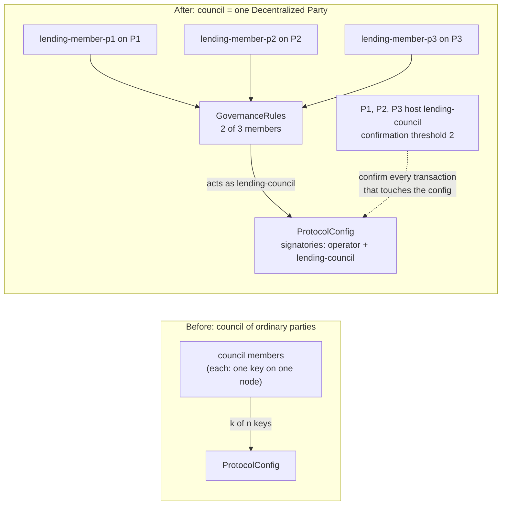

# BitSafe Decentralization Manager on LocalNet: runbook

The lending council runs as one **Decentralized Party** created by BitSafe's Decentralization
Manager (DecMan). The party is hosted on three participant nodes, and its namespace belongs to
three owner keys with threshold 2. Its `GovernanceRules` (governance-core-v1) need 2 of 3 member
confirmations. The demo changes the CBTC Collateral Factor (`borrowCollateralFactor`) by such a
vote and shows that a borrow above the new limit is rejected and a borrow within it is accepted.

Status: **works on this machine** (MacBook, 16 GB RAM, Docker VM 7.8 GB). A clean run of
`all.sh` from zero, including the node outage test, takes 13 minutes (2026-10-03, 18:11 to
18:25); LocalNet start-up takes 4 to 5 of them. Section 3 has the logs.

What ran:

| Step                  | Who does it                                                                                         | Result                                                                                                                                                           |
| --------------------- | --------------------------------------------------------------------------------------------------- | ---------------------------------------------------------------------------------------------------------------------------------------------------------------- |
| LocalNet              | Splice 0.6.12 compose: `canton`, `splice`, `postgres`                                               | 3 participants: app-provider (P1), app-user (P2), sv (P3)                                                                                                        |
| DecMan nodes          | `dec-party-manager` 1.13.0 built from upstream `main` (e08d9a4), one per participant                | Noise mesh of 3 peers                                                                                                                                            |
| Decentralized Party   | DecMan onboarding workflow                                                                          | `lending-council::1220…`, 3 owner keys, threshold 2, confirmation rights on P1, P2, P3                                                                           |
| DARs                  | DecMan DARs workflow                                                                                | governance-action-v1, governance-core-v1, lending-core-v2 1.0.3, lending-governance-v2 1.0.4, lending-decman 0.2.5, lending-mocks, lending-tests vetted on all 3 |
| GovernanceRules       | DecMan contracts workflow (submission signed by the owner keys)                                     | members `lending-member-p1..p3`, one per participant, threshold 2                                                                                                |
| Protocol and vote     | `Test.Lending.DecManLocalNet:runOnExisting` (Daml Script, 3 participants)                           | council formed by a 2-of-3 vote, CBTC factor 0.5 → 0.45, borrow 50% rejected, 45% accepted                                                                       |
| Vote in DecMan        | `proposeOnExisting` + DecMan `POST /governance/confirm` on P2, P3, `POST /governance/execute` on P1 | CBTC factor 0.45 → 0.40, read back from P2's ledger                                                                                                              |
| Hosting nodes offline | `06-node-offline.sh`: Admin API `DisconnectSynchronizer` on P3, then P2, then reconnect             | one host down: vote and user supply pass; two down: both time out; after reconnect the vote and the supply pass and P3 catches up                                |

The script **takes** the party and its rules from `--input-file`; it never creates them. On the IDE
ledger the same flow runs as `test_localNetOnIde`, where a setup step creates a party and 2-of-3
rules first (task 22). `DecManTest` and `BitSafeDemo` are unchanged.

## What the demo proves

For the BitSafe challenge judges. The log excerpts below come from the clean run of 2026-10-03
(section 3 has the full log).

### The risk

`ProtocolConfig` holds the lending risk parameters: Collateral Factor (`borrowCollateralFactor`),
liquidation factor, rate model, caps. Whoever changes it controls every open loan. If one key can
lower the CBTC Collateral Factor from 0.5 to 0.3, each borrower above 30% loan-to-value becomes
liquidatable at once. The second risk is availability: if the council lives on one
node, that node going down stops governance. The run shows a third point we did not expect: it
stops users too, because every supply and borrow reads the council-signed config.

### Before and after



Before, `lending-governance-v2` already had a k-of-n council, but each member was a party with one
key on one participant. Now the council has one member, `lending-council`, and that party has no
single key: three owner keys hold its namespace and three participants host it.

### Nodes and operators

| Node | LocalNet participant | Ledger gRPC / JSON / Admin API | DecMan node | Member party        | Owner key of `lending-council` | Operator in the demo | Operator in production (plan)             |
| ---- | -------------------- | ------------------------------ | ----------- | ------------------- | ------------------------------ | -------------------- | ----------------------------------------- |
| P1   | `app-provider`       | 3901 / 3975 / 3902             | :8081       | `lending-member-p1` | key 1 of 3                     | us, one laptop       | Canton Lending (the protocol operator)    |
| P2   | `app-user`           | 2901 / 2975 / 2902             | :8082       | `lending-member-p2` | key 2 of 3                     | us, one laptop       | an independent risk partner               |
| P3   | `sv`                 | 4901 / 4975 / 4902             | :8083       | `lending-member-p3` | key 3 of 3                     | us, one laptop       | a third organization (validator operator) |

In the demo all three participants run in one `canton` container, in one JVM, on one laptop, and
one person starts them. The independence you see is cryptographic and protocol-level: each
participant has its own id and signing keys, each DecMan node holds its own owner key, and each
member party lives on one node only. No node can sign for another, and the logs show each
confirmation submitted through its own node. Physical and organizational independence is not
there. P1 also hosts the lending operator party and the test users.

In production each row is a separate organization: its own validator node in its own cloud
account with its own Postgres, its own DecMan node with the owner key in its own KMS, and its own
people who confirm actions in DecMan. Operators count as independent when no single company, admin
or cloud account can reach two of the three owner keys or take two of the three nodes down.

### Thresholds

| What                                        | Threshold                        | Set by                                      | Read from                                        |
| ------------------------------------------- | -------------------------------- | ------------------------------------------- | ------------------------------------------------ |
| Namespace of `lending-council` (owner keys) | 2 of 3                           | DecMan onboarding, `threshold: 2`           | Admin API `ListDecentralizedNamespaceDefinition` |
| Hosting: `PartyToParticipant` confirmation  | 2 of 3 hosts, all `CONFIRMATION` | DecMan onboarding                           | Admin API `ListPartyToParticipant`               |
| Party signing keys in the same mapping      | 2 of 3                           | DecMan onboarding                           | same, `partySigningKeys.threshold`               |
| `GovernanceRules` member confirmations      | 2 of 3 members                   | `03-rules.sh` through DecMan contracts flow | the contract (`state-rules.json`)                |
| Lending `GovernanceCouncil`                 | 1 of 1 (`lending-council`)       | `runOnExisting`                             | the real quorum is the DecMan one above          |

`06-node-offline.sh` prints the first two from the topology on every run:

```text
== topology of lending-council on global-domain
  namespace owners: 2 of 3 owner keys
  hosting (PartyToParticipant): confirmation threshold 2, hosts:
    participant::1220bbc74960… CONFIRMATION
    participant::1220dee811f8… CONFIRMATION
    sv::1220c186c72d… CONFIRMATION
  GovernanceRules: threshold 2 of 3 members
```

### Shared control: below the threshold nothing executes

The operator alone cannot touch the config, and one member confirmation cannot execute a change.
From `04-demo.sh` and `06-node-offline.sh` of the same run:

```text
4. Operator alone changes params: REJECTED: Authorization failure: DAML_AUTHORIZATION_ERROR … Lending.Config:ProtocolConfig requires authorizers …
6. Member p1 confirms; execute with 1 of 2 confirmations: REJECTED: … AssertionFailed … "The requirement 'Enough confirmations to execute' …"
7. Member p2 confirms on its own node and executes: CBTC borrowCollateralFactor = 0.45

  DecMan :8082 lists it as: {"action_label":"LendingParams","description":"Lending run1-offline-0.35 (operator 'run1-Operator-…'): CBTC borrowCollateralFactor 0.4 -> 0.35; …"}
  member p1 confirms on DecMan :8081 (18:22:14, took 1 s): {"message":"Confirmation submitted successfully"} (HTTP 200)
  execute on DecMan :8081 with 1 confirmation(s) (18:22:14): REJECTED AssertionFailed: The requirement 'Enough confirmations to execute action' was not met (HTTP 500)
  member p2 confirms on DecMan :8082 (18:22:15, took 1 s): {"message":"Confirmation submitted successfully"} (HTTP 200)
  execute on DecMan :8081 with 2 confirmation(s) (18:22:15): {"message":"Action executed successfully"} (HTTP 200)
```

### Distributed hosting: one node offline, then two

"Offline" here means the participant disconnects from the synchronizer through its Admin API
(`SynchronizerConnectivityService.DisconnectSynchronizer`). Its process, Ledger API and DecMan node
keep running, but it receives no transaction views and sends no confirmations, so for the
sequencer and the mediator it is gone. LocalNet runs the three participants in one JVM, so we
cannot stop one participant process alone.

A transaction that needs `lending-council` to confirm passes when 2 of its 3 hosts confirm.

```text
== A. P3 (sv) offline
  2 of 3 hosts connected, threshold 2
  execute on DecMan :8081 with 2 confirmation(s) (18:22:15): {"message":"Action executed successfully"} (HTTP 200)
  CBTC borrowCollateralFactor on each host's ledger: P1 0.35, P2 0.35, P3 0.4
  user: Alice supplies 100.0 USDCx (18:22:25, …): accepted

== B. P2 (app-user) offline too: one host left
  1 of 3 hosts connected, threshold 2
  member p1 proposes CBTC borrowCollateralFactor -> 0.30 (00adefb93128f225…): created, the party is only an observer
  member p1 confirms on DecMan :8081 (18:23:07, took 32 s): REJECTED MEDIATOR_SAYS_TX_TIMED_OUT(2,0): Rejected transaction as the mediator did not receive sufficient confirmations within the expected timeframe. (HTTP 500)
  user: Alice supplies 100.0 USDCx (18:24:00, …): REJECTED: Unknown error: MEDIATOR_SAYS_TX_TIMED_OUT(2,0): …
  CBTC borrowCollateralFactor on each host's ledger: P1 0.35, P2 0.35, P3 0.4

== C. P2 and P3 back
  3 of 3 hosts connected, threshold 2
  CBTC borrowCollateralFactor on each host's ledger: P1 0.35, P2 0.35, P3 0.35
  execute on DecMan :8081 with 2 confirmation(s) (18:24:07): {"message":"Action executed successfully"} (HTTP 200)
  CBTC borrowCollateralFactor on each host's ledger: P1 0.3, P2 0.3, P3 0.3
  user: Alice supplies 100.0 USDCx (18:24:56, …): accepted
```

What this shows:

- With one host offline, members p1 and p2 vote a change through DecMan and a user supply goes
  through. The protocol stays available at the hosting threshold.
- With two hosts offline, the mediator waits about 30 s for a second confirmation of
  `lending-council` and rejects the transaction. Nothing is half-applied: DecMan still counts 0
  confirmations, and the config stays at 0.35 on every host.
- P3 missed the 0.4 → 0.35 change while offline and has it within 3 s of reconnecting, before
  the next vote. The proposal created during the outage stays valid and passes after recovery.
- Users depend on the party's hosts, not only governance. `Pool_SupplyBase`,
  `Pool_SupplyCollateral` and `Pool_WithdrawBase` (borrow) fetch the `ProtocolConfig` that
  `lending-council` signs, and Canton asks the signatories of a fetched contract to confirm. With
  2 of 3 thresholds the protocol survives one outage. A t-of-n hosting threshold survives n − t
  outages and t − 1 compromised hosts; for MainNet we propose 3 of 5 hosts.

Not shown: P1 offline. P1 is also the only host of the lending operator party, which signs the
pool and the accounts, so with P1 down every user operation stops regardless of DecMan. Hosting
the operator on more than one node is open work (below).

### What DecMan governs and what stays with the operator

| Through a DecMan vote (`lending-decman`, each template implements `GovernableAction`)                                                               | Stays with a single role                                                                   |
| --------------------------------------------------------------------------------------------------------------------------------------------------- | ------------------------------------------------------------------------------------------ |
| `LendingParamsAction`: protocol and market parameters; factories, roles and the Featured App right are proposed here and the operator executes them | custody of pool and collateral tokens (`lendingOperator`)                                  |
| `LendingExecuteParamsAction`: apply a delayed change (a lower liquidation factor after its 2-day delay)                                             | account opening, interest accrual (`Pool_Accrue`), absorb of unhealthy accounts (operator) |
| `LendingMarketAction`, `LendingDelistAction`: list or remove a collateral market (the operator executes the listing)                                | prices and reserve attestations (`oracle`)                                                 |
| `LendingIncomeAction`: protocol income and reserves (`treasury` executes)                                                                           | pause and unpause (`guardian`)                                                             |
| `LendingRotationAction`: change the council                                                                                                         | collateral purchases (`backstop`, approved liquidators)                                    |
| `LendingWithdrawAction`: withdraw a proposal still waiting for the operator or treasury                                                             |                                                                                            |

Where the operator must execute, it can refuse a change but cannot make one: `Config_Update`
needs both the operator and `lending-council`.

### Reusable parts

- `daml/lending-decman` (`Lending.DecMan`): `GovernableAction` templates for a lending protocol.
  The proposer signs, the governance party observes, preconditions sit in `ensure`, every contract
  id is re-checked at execution, and the DecMan card shows a diff
  ("CBTC borrowCollateralFactor 0.4 -> 0.35"). Any Canton app with a council-signed config can copy
  the pattern.
- `deploy/bitsafe-localnet/`: LocalNet, three DecMan nodes, a Decentralized Party, DAR
  distribution, `GovernanceRules` and the outage test from a clean machine with one command.
  `lib.sh` wraps the DecMan HTTP API, the JSON Ledger API and the Canton Admin API (`admin`,
  `connected`).
- `Test.Lending.DecManLocalNet`: a Daml Script that takes a DecMan-made party and rules through
  `--input-file` and checks them before use.

### Guardian as observer, and traffic per operation (`07-traffic-guardian.sh`)

ADR-009 left two points of the Compound V3 model unchecked: whether the guardian can stay an
observer of `PauseState` (К7), and what each pool operation costs in sequencer traffic. The script
needs only `00-localnet.sh up`, no DecMan. It deploys the protocol with the guardian on P2 and every
other party on P1, then runs `Test.Lending.LocalNetProbe` one step per `dpm script` call. Between
the calls it reads Canton's counter `daml_sequencer_client_traffic_control_event_delivered_cost_total`
per participant once it stops moving.

**Guardian.** With P2 disconnected from the synchronizer, a borrow, a collateral withdrawal, an
absorb and a collateral purchase all commit. Each of them reads `PauseState`. Back online, the
guardian sets `borrowPaused`, a borrow is refused with "borrowing paused", and the guardian lifts
the flag. The guardian's node takes no part in user operations: P2 spent 0 bytes on every one of
them. One stray 3.8 KB entry in one of three runs came from the app-user validator's own automation.

**Traffic.** Run of 2026-10-05, lending-core-v2 1.0.3, Splice 0.6.12. Bytes are the confirmation
request. Confirmation responses are free on the Global Synchronizer (`freeConfirmationResponses`).
USD is at the Splice extra-traffic price of $16.67 per MB, as on MainNet. CC is at the
02.10 price of $0.1226.

| Operation                                         | Bytes |   USD |   CC |
| ------------------------------------------------- | ----: | ----: | ---: |
| `Pool_SupplyBase` (supply)                        | 5 457 | 0.091 | 0.74 |
| `Pool_SupplyBase` (repay)                         | 5 787 | 0.096 | 0.79 |
| `Pool_SupplyCollateral`                           | 5 321 | 0.089 | 0.72 |
| `Pool_WithdrawBase`, borrow, one collateral asset | 6 715 | 0.112 | 0.91 |
| `Pool_WithdrawBase`, borrow, CC and CBTC          | 6 577 | 0.110 | 0.89 |
| `Pool_WithdrawCollateral`, one asset              | 6 822 | 0.114 | 0.93 |
| `Pool_WithdrawCollateral`, CC and CBTC            | 6 538 | 0.109 | 0.89 |
| `Pool_Absorb`                                     | 5 456 | 0.091 | 0.74 |
| `Pool_BuyCollateral`                              | 6 776 | 0.113 | 0.92 |
| `PriceFeed_Update` (oracle)                       | 3 133 | 0.052 | 0.43 |
| `PauseState_SetFlag` (guardian, on P2)            | 3 339 | 0.056 | 0.45 |

Three runs differed by under 20 bytes per operation.

- A pool operation costs 5.3 to 6.8 KB, about $0.09 to $0.11. Free base traffic is 400 000 bytes
  per 20 minutes per node, about 60 operations; past that the operator buys extra traffic.
- The probe passes the CC and CBTC feeds with every risk-raising operation (`allPrices`), and the
  contract fetches every feed passed. So the one-asset and two-asset rows read the same contracts,
  and a second asset in the account costs nothing measurable. The backend passes only the feeds
  of the assets the account holds, so a one-asset account there is a little cheaper than the
  table shows.
- Not measured: the cost before the migration, with lending-core 0.7.0 on `daml/released/v1`.
  Its operations need different scripts and parties.

### Remaining work

- Council web page for a DecMan council: proposing and confirming from the page (today the page
  only shows the votes; section 7).
- TestNet, then MainNet: three organizations each run a validator (Docker Compose on TestNet,
  Helm on MainNet) and a DecMan node with the owner key in its own KMS; they peer over Noise,
  onboard `lending-council` and vet the DARs through DecMan. For MainNet: five hosts, threshold 3.
- Host the lending operator party on several nodes, so a P1 outage does not stop users.
- Move the user supply of `06-node-offline.sh` into `Test.Lending.DecManLocalNet`; today the
  script builds a small helper package at run time.

## 1. Requirements

| Resource      | Needed                                                                                                                                                                                                   | Measured on this machine                                                                                                                                        |
| ------------- | -------------------------------------------------------------------------------------------------------------------------------------------------------------------------------------------------------- | --------------------------------------------------------------------------------------------------------------------------------------------------------------- |
| Docker memory | 6.5 GB free for the three containers                                                                                                                                                                     | canton 2.85 GB (limit 3 GB), splice 1.3 GB (limit 2.5 GB), postgres 1 GB (limit 1 GB)                                                                           |
| Host memory   | DecMan nodes and `dpm script`                                                                                                                                                                            | 3 DecMan nodes: 46 MB together; `dpm script`: a JVM of about 1 GB for one minute                                                                                |
| Disk          | about 7 GB                                                                                                                                                                                               | images 3.1 GB (canton 1.04 GB, splice-app 1.58 GB, postgres:14 0.46 GB), LocalNet bundle 0.8 GB, Rust build 1.5 GB plus 0.5 GB of crates, Rust 1.94.1 toolchain |
| CPU           | any 4+ cores                                                                                                                                                                                             | 10 cores; the Rust build takes 2 minutes with 6 jobs                                                                                                            |
| Tools         | Docker Compose v2.1.1+, `jq`, `curl`, `lsof`, `buf` (Admin API calls in `06-node-offline.sh`), Rust **1.94.1+** (the AWS SDK crates refuse 1.93), dpm with Daml SDK 3.5.12 and JDK 17 (`scripts/env.sh`) |                                                                                                                                                                 |
| Free ports    | 2901-2903, 2975, 3901-3903, 3975, 4901-4903, 4975 (LocalNet), 15432 (LocalNet postgres), 8081-8083, 9001-9003, 9464-9466 (DecMan)                                                                        |                                                                                                                                                                 |

The stock LocalNet limits (canton 4 GB, splice 3 GB, postgres 2 GB) add up to 9 GB and do not fit
a 7.8 GB Docker VM. `deploy/bitsafe-localnet/low-memory.yaml` trims them: canton heap 2 GB, splice heap 1.8 GB.
With 12 GB or more for Docker, drop the `-f low-memory.yaml` line from `00-localnet.sh`. Canton
sits near its 3 GB limit; if it gets OOM-killed (`docker ps` shows a restart), give Docker more
memory first.

Not started: nginx and the seven web UIs of LocalNet (wallet, ANS, scan, SV). DecMan and the
scripts talk to the participants' gRPC and JSON APIs directly, as DecMan's own integration
tests do.

## 2. From a clean clone

```sh
# 0. lending repo: build the DARs (lending-tests includes Test.Lending.DecManLocalNet)
git clone https://github.com/rwa-market/lending.git && cd lending
pnpm install && sh scripts/daml.sh build

# 1. upstream DecMan into .local/decman (gitignored), at the commit lending-decman was built against
git clone https://github.com/DLC-link/decentralization-manager.git .local/decman
git -C .local/decman checkout e08d9a4

# 2. DecMan binary (no embedded web UI: the demo drives its HTTP API)
rustup toolchain install 1.94.1 --profile minimal
(cd .local/decman && DECMAN_SKIP_FRONTEND=1 cargo +1.94.1 build --profile release-ci -p decman --bin dec-party-manager)

# 3. everything else: LocalNet, DecMan nodes, party, DARs, rules, lending demo, DecMan vote
pnpm demo:bitsafe:localnet          # = bash deploy/bitsafe-localnet/all.sh
```

The scripts are in `deploy/bitsafe-localnet/`. `DECMAN_DIR` (default `.local/decman`) and
`LENDING_DAML` (default this repo's `daml/`) override the paths.

`all.sh` runs the numbered scripts in order; each one can be run alone:

| Script                                | What it does                                                                                                                                                                                                                                                                     |
| ------------------------------------- | -------------------------------------------------------------------------------------------------------------------------------------------------------------------------------------------------------------------------------------------------------------------------------- |
| `00-localnet.sh up`                   | downloads the Splice 0.6.12 bundle once (760 MB), starts `canton`, `splice`, `postgres` and waits for health                                                                                                                                                                     |
| `nodes.sh`                            | starts three `dec-party-manager --insecure` nodes with upstream `integration-tests/env.sh`, exchanges Noise keys, restarts them                                                                                                                                                  |
| `01-decparty.sh`                      | `POST /onboarding` on P1 with P2 and P3 as peers, threshold 2; P2 and P3 accept; prints the party                                                                                                                                                                                |
| `02-dars.sh`                          | `POST /dars/upload` + `/dars/distribute`; P2 and P3 accept; prints vetted packages per node                                                                                                                                                                                      |
| `03-rules.sh`                         | allocates `lending-member-pN` on each participant, grants `ledger-api-user` rights on it and on the party, `PUT /party-config` on each node, `POST /contracts` with `GovernanceRules` (2 of 3); writes `state-input.json` and `state-participants.json`                          |
| `04-demo.sh <prefix>`                 | `dpm script … runOnExisting --participant-config state-participants.json --input-file …`                                                                                                                                                                                         |
| `05-decman-vote.sh <prefix> <factor>` | a second change voted in DecMan itself, read back from P2                                                                                                                                                                                                                        |
| `06-node-offline.sh <prefix>`         | prints the party's thresholds from the topology; P3 offline: execute with 1 confirmation fails, a 2-of-3 vote and a user supply pass; P2 offline too: both time out; reconnect: P3 catches up, the vote and the supply pass. Builds a small helper DAR into `nodes/` once (30 s) |

The input of `runOnExisting` (from `03-rules.sh`):

```json
{
  "decParty": "lending-council::1220…",
  "rulesCid": "0056a59a…",
  "members": [
    "lending-member-p1::1220e580…",
    "lending-member-p2::12204674…",
    "lending-member-p3::1220bbe3…"
  ],
  "prefix": "run1-",
  "ledgerUser": "ledger-api-user"
}
```

`state-participants.json` sends member p2's and p3's commands to their own participants (P2 :2901,
P3 :4901); everything else goes to P1 (:3901). Each member submits as itself with `readAs` of the
Decentralized Party, the same way a DecMan node does. The script checks the input before using
it: the rules must belong to `decParty`, list exactly `members` and have a threshold from 2 to the
member count.

`prefix` must be new on every run against the same ledger. Daml Script appends a hash to party
hints, so look up the operator in `result-<prefix>.json`, not by name.

## 3. Log of the clean run (trimmed)

```text
######## LocalNet up (12:59:17)
######## DecMan nodes (13:02:57)
P1 participant::1220e5804ad84e91db1e018a0ff7602f7cc5411d1fe325c460b2cdf0df53d35eff63
P2 participant::1220467480366c0415f5a57d203cbd66c016aa0c2359cc9dfe6d3a598584d6ae327f
P3 sv::1220bbe372d2ae5f3cf90d8932a61d6c89af91cbe3035c2683dce07faea4be1e6af3

######## Decentralized Party (13:03:15)
{"status":"inprogress","message":"Onboarding workflow started", …}
  node :8082 accepted Onboarding invitation onboarding-02613f680c8a1c2a-…-creation
  node :8083 accepted Onboarding invitation onboarding-02613f680c8a1c2a-…-creation
  /onboarding/status: completed
{
  "party_id": "…::122055c82a887e6b0a9279bfeea2532c7e7dc43addc6a556f5e8ffd497c43d1f0a63",
  "threshold": 2,
  "owners": ["122021304f4e…", "12206b9b182a…", "1220831ea62c…"],
  "participants": [
    {"participant_uid": "participant::12204674…", "permission": "confirmation", "owner_key": "1220831ea62c…"},
    {"participant_uid": "participant::1220e580…", "permission": "confirmation", "owner_key": "122021304f4e…"},
    {"participant_uid": "sv::1220bbe3…",          "permission": "confirmation", "owner_key": "12206b9b182a…"}
  ]
}

######## DARs (13:03:40)
  /dars/distribute/status: completed
  vetted on :8081: governance-action-v1 governance-core-v1 lending-core-v2 lending-decman lending-deploy lending-governance-v2 lending-mocks lending-tests
  vetted on :8082: (same)
  vetted on :8083: (same)

######## GovernanceRules (13:05:20)
  member p1: lending-member-p1::1220e580… (JSON API :3975)
  member p2: lending-member-p2::12204674… (JSON API :2975)
  member p3: lending-member-p3::1220bbe3… (JSON API :4975)
== GovernanceRules on …::122055c8…: members p1 p2 p3, threshold 2
  node :8082 accepted Contracts invitation …
  node :8083 accepted Contracts invitation …
  /contracts/status: completed
  GovernanceRules: 0056a59a0b44d88a…

######## Lending demo (script) (13:05:53)
1. Decentralized party '…::122055c8…': GovernanceRules 2 of 3 members
2. Protocol deployed: config, pool, CC and CBTC markets, prices, test tokens
3. Council formed by a 2-of-3 vote: governors = ['…::122055c8…']
4. Operator alone changes params: REJECTED: Authorization failure: DAML_AUTHORIZATION_ERROR … Lending.Config:ProtocolConfig requires authorizers <decentralized party>, <operator> …
5. Member p1 proposes CBTC borrowCollateralFactor 0.5 -> 0.45 (LendingParamsAction)
6. Member p1 confirms; execute with 1 of 2 confirmations: REJECTED: … AssertionFailed … "The requirement 'Enough confirmations to execute' …"
7. Member p2 confirms on its own node and executes: CBTC borrowCollateralFactor = 0.45
8. Borrow 5 000 USDCx on $10 000 CBTC (50%, above the new limit): REJECTED: … message = "not enough collateral for the loan"
9. Borrow 4 500 USDCx (45%, within the new limit): accepted
{
  "factorBefore": 0.5, "factorAfter": 0.45,
  "operatorAloneUpdate": "REJECTED", "executeWithOneConfirmation": "REJECTED",
  "borrowAboveLimit": "REJECTED", "borrowWithinLimit": "accepted",
  "governors": ["…::122055c8…"],
  "operator": "run1-Operator-d4d95138::1220e580…"
}

######## Vote through DecMan API (13:07:01)
== proposal 0066b2e2b81ae1a4… (LendingParamsAction, CBTC borrowCollateralFactor -> 0.4)
  DecMan :8081 lists it: {"action_label":"LendingParams","confirmation_count":0,"can_execute":false}
  DecMan :8082 lists it: {"action_label":"LendingParams","confirmation_count":0,"can_execute":false}
  DecMan :8083 lists it: {"action_label":"LendingParams","confirmation_count":0,"can_execute":false}
  confirm on :8082: {"message":"Confirmation submitted successfully"}
  confirm on :8083: {"message":"Confirmation submitted successfully"}
  P1 sees: {"confirmation_count":2,"can_execute":true,"confirmers":["lending-member-p3","lending-member-p2"]}
  execute on :8081: {"message":"Action executed successfully"}
{"seenOn":"P2 (app-user)","governors":["…::122055c8…"],"cbtcBorrowCollateralFactor":"0.400000000000000000"}

######## done (13:07:16)
real 480.29
```

In that run the party prefix came out as `run1-` because of a variable clash in `all.sh`, since
fixed (`DECPARTY_PREFIX` for the party, `RUN_PREFIX` for the demo); a later `01-decparty.sh` on
the same net produced `lending-council::1220398d…`. An earlier run on the same machine read the
config on all three hosts after the vote: P1, P2 and P3 each showed governors
`[lending-council::…]` and CBTC `0.45`.

Why this is a real decentralized setup:

- The party's namespace has three owner keys, one per DecMan node, threshold 2. No node can
  change the party's topology alone.
- All three participants host the party with confirmation rights, so every transaction that
  touches the protocol config (the party is its governor) is confirmed by the party's hosts.
- `GovernanceRules` was created by DecMan's contracts workflow, whose submission the owner
  keys signed, not by one participant submitting as the party.
- Member p2 exists only on P2, so its confirmation in step 7 was submitted on P2; in the DecMan
  vote P2 and P3 confirmed through their own nodes' APIs.

### `06-node-offline.sh` (run of 2026-10-03, 18:21, lending-decman 0.2.5)

```text
######## Hosting nodes offline (18:21:31)
== topology of lending-council on global-domain
  namespace owners: 2 of 3 owner keys
  hosting (PartyToParticipant): confirmation threshold 2, hosts:
    participant::1220bbc74960… CONFIRMATION
    participant::1220dee811f8… CONFIRMATION
    sv::1220c186c72d… CONFIRMATION
  GovernanceRules: threshold 2 of 3 members

== start (18:22:02): 3 of 3 hosts connected, threshold 2
  CBTC borrowCollateralFactor on each host's ledger: P1 0.4, P2 0.4, P3 0.4

== A. P3 (sv) offline
  P3 OFFLINE (18:22:03): DisconnectSynchronizer(global); connected synchronizers now: []
  2 of 3 hosts connected, threshold 2
  member p1 proposes CBTC borrowCollateralFactor -> 0.35 (LendingParamsAction 0055e973ea0ab42c…)
  DecMan :8082 lists it as: {"action_label":"LendingParams","description":"Lending run1-offline-0.35 (operator 'run1-Operator-d4d95138::1220bbc7…'): CBTC borrowCollateralFactor 0.4 -> 0.35; proposer's note: CB…
  member p1 confirms on DecMan :8081 (18:22:14, took 1 s): {"message":"Confirmation submitted successfully"} (HTTP 200)
  execute on DecMan :8081 with 1 confirmation(s) (18:22:14): REJECTED AssertionFailed: The requirement 'Enough confirmations to execute action' was not met (HTTP 500)
  member p2 confirms on DecMan :8082 (18:22:15, took 1 s): {"message":"Confirmation submitted successfully"} (HTTP 200)
  DecMan :8081 sees: {"confirmation_count":2,"can_execute":true}
  execute on DecMan :8081 with 2 confirmation(s) (18:22:15): {"message":"Action executed successfully"} (HTTP 200)
  CBTC borrowCollateralFactor on each host's ledger: P1 0.35, P2 0.35, P3 0.4
  user: Alice supplies 100.0 USDCx (18:22:25, took 9 s with the script's JVM start): accepted

== B. P2 (app-user) offline too: one host left
  P2 OFFLINE (18:22:26): DisconnectSynchronizer(global); connected synchronizers now: []
  1 of 3 hosts connected, threshold 2
  member p1 proposes CBTC borrowCollateralFactor -> 0.30 (00adefb93128f225…): created, the party is only an observer
  member p1 confirms on DecMan :8081 (18:23:07, took 32 s): REJECTED MEDIATOR_SAYS_TX_TIMED_OUT(2,0): Rejected transaction as the mediator did not receive sufficient confirmations within the expected timeframe. (HTTP 500)
  DecMan :8081 sees: {"confirmation_count":0,"can_execute":false}
  user: Alice supplies 100.0 USDCx (18:24:00, took 52 s with the script's JVM start): REJECTED: Unknown error: MEDIATOR_SAYS_TX_TIMED_OUT(2,0): Rejected transaction as the mediator did not receive sufficient confirmations within the expected timeframe.
  CBTC borrowCollateralFactor on each host's ledger: P1 0.35, P2 0.35, P3 0.4

== C. P2 and P3 back
  P2 back ONLINE (18:24:01): connected synchronizers: [global]
  P3 back ONLINE (18:24:02): connected synchronizers: [global]
  3 of 3 hosts connected, threshold 2
  CBTC borrowCollateralFactor on each host's ledger: P1 0.35, P2 0.35, P3 0.35
  member p1 confirms on DecMan :8081 (18:24:05, took 1 s): {"message":"Confirmation submitted successfully"} (HTTP 200)
  member p2 confirms on DecMan :8082 (18:24:07, took 2 s): {"message":"Confirmation submitted successfully"} (HTTP 200)
  DecMan :8081 sees: {"confirmation_count":2,"can_execute":true}
  execute on DecMan :8081 with 2 confirmation(s) (18:24:07): {"message":"Action executed successfully"} (HTTP 200)
  CBTC borrowCollateralFactor on each host's ledger: P1 0.3, P2 0.3, P3 0.3
  user: Alice supplies 100.0 USDCx (18:24:56, took 13 s with the script's JVM start): accepted

######## done (18:24:57)
real 788.61
```

Steps 1 to 9 and the DecMan vote of the same run match the log above, with other party ids.
Peak memory during the run: canton 2.84 GB of its 3 GB limit, splice 1.35 GB, postgres 1 GB (at
its limit); no container restarted.

## 4. Run on the IDE ledger (no LocalNet)

```sh
cd lending/daml/lending-tests
. ../../scripts/env.sh
dpm script --dar .daml/dist/lending-tests-1.0.0.dar --ide-ledger --static-time \
  --script-name Test.Lending.DecManLocalNet:test_localNetOnIde
dpm script --dar .daml/dist/lending-tests-1.0.0.dar --ide-ledger --static-time \
  --script-name Test.Lending.DecManLocalNet:test_localNetRejectsForeignRules
```

Both pass (`SUCCESS`), and `dpm test` picks them up with the rest of the suite.
`test_localNetOnIde` creates a party and 2-of-3 rules with a plain submit (the IDE ledger has no
DecMan), then calls the same `runOnExisting`. `test_localNetRejectsForeignRules` checks the input
validation: rules of another party, a different member set, threshold 1 and threshold above the
member count are refused, while 2 of 3 and 3 of 3 pass.

## 5. Teardown

```sh
deploy/bitsafe-localnet/stop-nodes.sh         # DecMan ignores SIGTERM: TERM, then KILL; removes nodes/ and state files
rm -rf deploy/bitsafe-localnet/traffic-*/      # 07-traffic-guardian.sh run state
deploy/bitsafe-localnet/00-localnet.sh down   # docker compose down -v: containers, network, postgres volume
# optional, frees about 5 GB:
docker image rm ghcr.io/digital-asset/decentralized-canton-sync/docker/canton:0.6.12 \
  ghcr.io/digital-asset/decentralized-canton-sync/docker/splice-app:0.6.12 postgres:14
rm -rf .local/decman/target .local/decman/.localnet
```

`nodes.sh` sources upstream `env.sh`, which makes an empty `decman-it-*` directory in `$TMPDIR`;
remove it with `rm -rf "${TMPDIR:-/tmp}"/decman-it-*`.

## 6. Known problems and workarounds

| Problem                                                                                                         | Seen as                                                                                            | Fix                                                                                                                                              |
| --------------------------------------------------------------------------------------------------------------- | -------------------------------------------------------------------------------------------------- | ------------------------------------------------------------------------------------------------------------------------------------------------ |
| Rust 1.93                                                                                                       | `aws-config@1.11.0 requires rustc 1.94.1`                                                          | `cargo +1.94.1 …`                                                                                                                                |
| No network during the Rust build                                                                                | `utoipa-swagger-ui` build script: `Could not resolve host: github.com`                             | download `https://github.com/swagger-api/swagger-ui/archive/refs/tags/v5.32.6.zip` and set `SWAGGER_UI_DOWNLOAD_URL=file:///path/to/v5.32.6.zip` |
| Port 5432 taken by a host Postgres                                                                              | compose fails to bind                                                                              | `00-localnet.sh` maps LocalNet postgres to 15432 (`DB_PORT`); nothing inside the containers uses that variable                                   |
| Redeploying a rebuilt `lending-tests` with the same version                                                     | `KNOWN_PACKAGE_VERSION … two packages with the same name and version`                              | the script's own package does not need to be on the ledger (`dpm script` does not upload by default); on a fresh LocalNet there is no conflict   |
| A second `04-demo.sh` with the same prefix                                                                      | `allocateParty` fails                                                                              | pass a new prefix: `deploy/bitsafe-localnet/04-demo.sh run2-`                                                                                    |
| `01-decparty.sh` reads `GET /decentralized-parties` right after `/onboarding/status` says completed             | empty `state-decparty.json`, then `03-rules.sh` exits with curl code 22 ("Daml-LF Party is empty") | `01-decparty.sh` retries until the party is listed                                                                                               |
| `dpm build` fails with `Could not find module 'Daml.Script'` or `cannot satisfy --package splice-test-token-v1` | another `damlc` (an IDE, a parallel `dpm test`) is writing the same `.daml/package-database`       | wait for it to finish and build again                                                                                                            |

## 7. The council page with a council of one Decentralized Party

Read: `frontend/src/pages/Council.tsx`, `frontend/src/features/council/{Forms,Items}.tsx`,
`features/council/model.ts`, backend `GET /governance` (`backend/src/routes/protocol.ts`,
`backend/src/protocol/reader.ts`). After the vote the on-ledger state is
`GovernanceCouncil { members = [lending-council::…], threshold = 1 }`, and config and pool have
`governors = [lending-council::…]`.

Since lending-decman 0.2.5 (PR #61) the page shows a DecMan council:

| What                                                                                                               | Where                               |
| ------------------------------------------------------------------------------------------------------------------ | ----------------------------------- |
| The quorum: "BitSafe 2 of 3" in the header instead of "1 of 1"                                                     | header stats                        |
| The seat marked "BitSafe party", its members and threshold                                                         | Members panel                       |
| Pending `GovernableAction`s (`LendingParamsAction`, …) with confirmations against the rules' threshold             | "BitSafe Decentralized Party" panel |
| A member of the rules opens the page read-only and is told to vote in DecMan on their node                         | `GET /governance`, the same panel   |
| DecMan's notification card shows a field-by-field diff ("CBTC Collateral Factor 0.45 → 0.40"), not the full record | `LendingParamsAction` description   |

The backend reads the rules, actions and confirmations as the operator; the e2e test "the council
page shows the BitSafe party, its threshold and the pending action" checks the panel.

Still open:

1. **No proposing or confirming from the page.** "New proposal", "Approve" and "Execute" sign as a
   council member, and no wallet holds the Decentralized Party's key. A member proposes and
   confirms in the DecMan UI or its HTTP API (`05-decman-vote.sh`).
2. **Seat bar** (`Seats` in `Items.tsx`) draws one seat; the 2 of 3 behind it is in the panel
   below, not in the bar.
